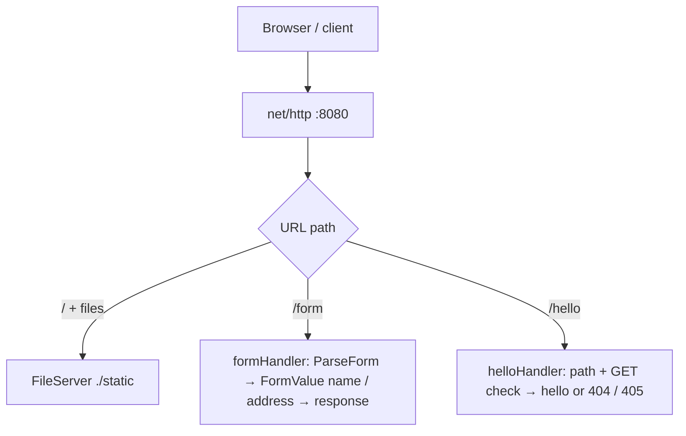
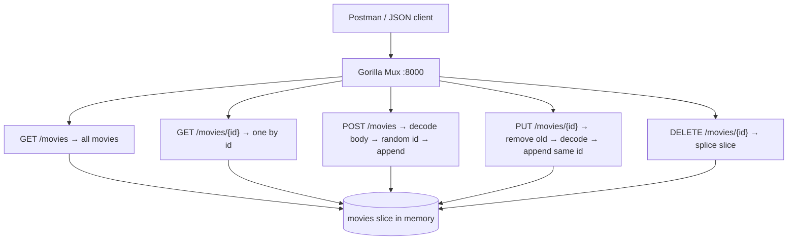
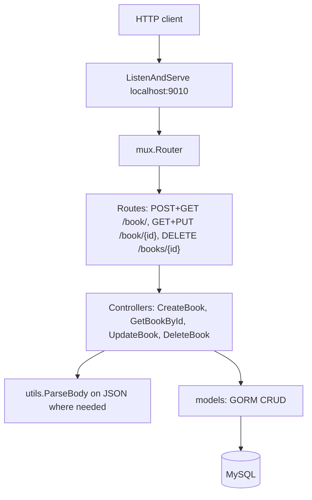

## Small Go projects to practice core language concepts

---

### 1. web-server

Serves static files from `./static`, a form handler on `/form`, and `/hello` on port **8080**.

---

### 2. movies-crud-postman

In-memory movie list with **Gorilla Mux** on port **8000**; JSON CRUD for `/movies` and `/movies/{id}`.

---

### 3. bookstore-api

REST API with **Gorilla Mux**, **GORM**, and **MySQL** on **localhost:9010**.

